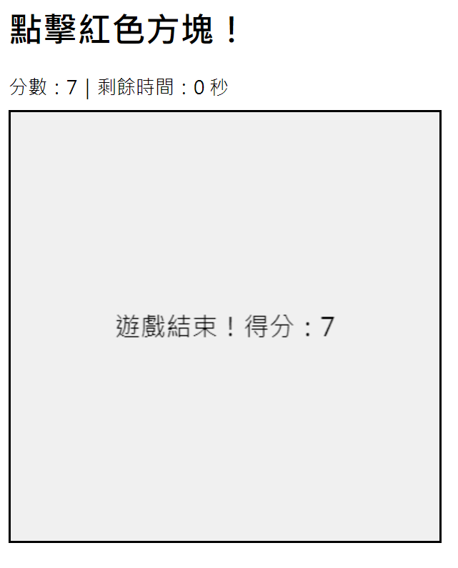

# [Game2](game2.html)

### 第 1 頁

這個遊戲是一個在瀏覽器中執行的「點擊方塊遊戲」，結合了 HTML5 的 Canvas 繪圖功能與 Brython 技術，讓 Python 程式碼可以直接在網頁中執行。玩家的目標是在限定時間內，點擊畫面中出現的紅色方塊來累積分數。

遊戲畫面由一個 400×400 像素的畫布組成，畫布上會隨機出現一個紅色方塊。頁面上方會即時顯示目前的分數以及剩餘遊戲時間。遊戲開始時，分數為零，倒數時間為三十秒。

當玩家用滑鼠點擊畫布時，程式會判斷點擊的位置是否落在紅色方塊的範圍內。如果成功點擊到方塊，玩家的分數就會增加一分，同時紅色方塊會立即移動到畫布中的另一個隨機位置，增加遊戲的挑戰性。

遊戲內建倒數計時機制，每秒鐘時間會減少一秒，並即時更新畫面上的剩餘時間顯示。當倒數時間歸零時，遊戲會自動結束，停止計時與滑鼠點擊事件，並清空畫布。

在遊戲結束時，畫面中央會顯示「遊戲結束」以及玩家的最終得分，讓玩家清楚知道自己在限定時間內的表現。整體遊戲流程簡單直觀，適合作為學習 Canvas 繪圖、事件處理以及 Brython 在網頁中應用的入門範例。

### 第 2 頁

